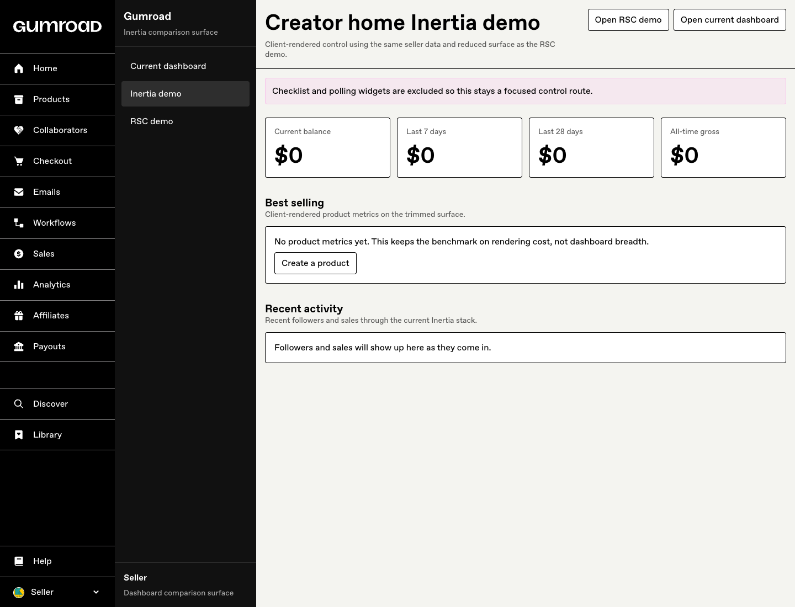
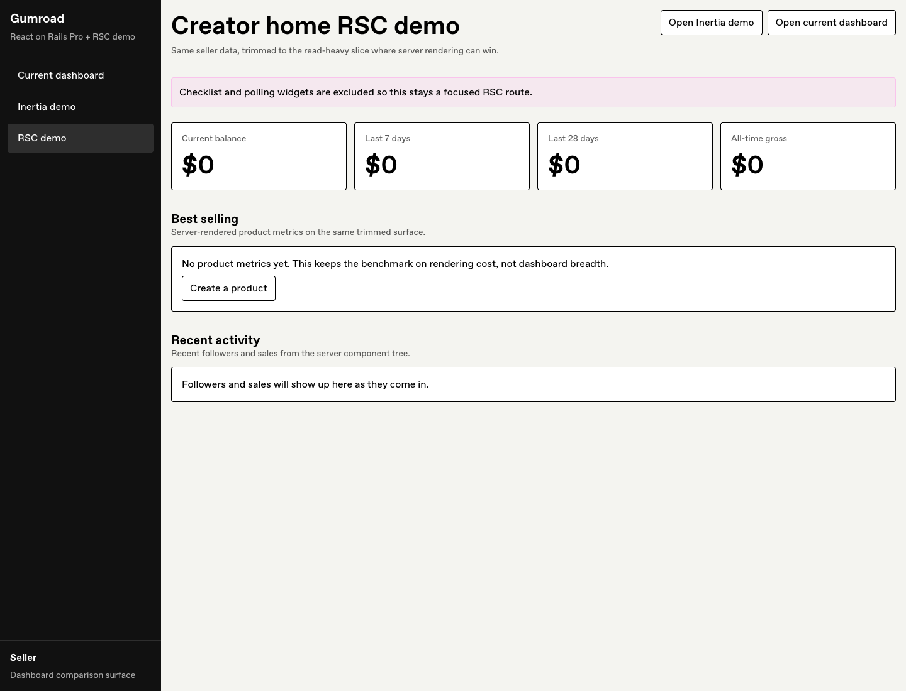

<p align="center">
  <picture>
    <source srcset="https://public-files.gumroad.com/logo/gumroad-dark.svg" media="(prefers-color-scheme: dark)">
    <source srcset="https://public-files.gumroad.com/logo/gumroad.svg" media="(prefers-color-scheme: light)">
    
  </picture>
</p>

<p align="center">
  <strong>Sell your stuff. See what sticks.</strong>
</p>

<p align="center">
  <a href="https://gumroad.com">Gumroad</a> is an e-commerce platform that enables creators to sell products directly to consumers. This repository contains the source code for the Gumroad web application.
</p>

> [!IMPORTANT]
> This is not Gumroad's canonical repository. It is a public ShakaCode experiment seeded from [`antiwork/gumroad`](https://github.com/antiwork/gumroad) to answer three questions:
>
> 1. Can this codebase move cleanly from Webpack to `Shakapacker + Rspack`?
> 2. What real React 19 adoption fallout appears on a non-trivial Rails app?
> 3. Can a bounded `React on Rails Pro + RSC` slice beat a matched `Inertia` control enough to justify the extra complexity?

## Public Experiment Repo

This repository tracks [antiwork/gumroad](https://github.com/antiwork/gumroad) and is being used by ShakaCode as a focused experiment for comparing the current Inertia-based implementation against a React on Rails Pro + React 19 + RSC implementation on carefully chosen surfaces.

The goal is not to argue that every Inertia page should be replaced. The goal is to determine whether a narrower set of pages can benefit enough from React 19, React on Rails Pro, and React Server Components to justify a deeper proposal later.

### Start here

- [docs/current-status.md](docs/current-status.md)
- [docs/performance-team-handoff.md](docs/performance-team-handoff.md)
- [docs/performance-findings.md](docs/performance-findings.md)
- [React on Rails issue #3128](https://github.com/shakacode/react_on_rails/issues/3128)
- [Benchmark and positioning issue #3144](https://github.com/shakacode/react_on_rails/issues/3144)
- [Consolidated demo PR #11](https://github.com/shakacode/react-on-rails-demo-gumroad-rsc/pull/11)
- [Follow-up PR #10](https://github.com/shakacode/react-on-rails-demo-gumroad-rsc/pull/10) for Shakapacker dev-server environment overrides
- [Production-like benchmark PR #12](https://github.com/shakacode/react-on-rails-demo-gumroad-rsc/pull/12)

### What this repo currently proves

- `Shakapacker 10 + Rspack` is viable on this codebase and materially faster for local builds.
- The demo assets are route-scoped, so ordinary Inertia pages do not pay for the experiment's extra JS or CSS.
- A bounded `React on Rails Pro + RSC` dashboard slice can beat a matched `Inertia` control on navigation duration and `LCP` under a stricter alternating benchmark that balances route order.
- The latest production-like compiled-asset pass keeps that advantage and improves median `responseEnd`, while `p95 responseEnd` still needs follow-up.
- Route-scoped `Server-Timing` and an alternating comparison runner now make that tradeoff measurable instead of anecdotal.
- The custom Webpack and Rspack config now honors `SHAKAPACKER_DEV_SERVER_*` overrides the same way Ruby/Shakapacker does, so local verification can move off `3035` cleanly when another repo is already using it.
- GitHub-hosted demo validation now includes a real browser smoke pass for both comparison routes, not just build and controller-spec checks.

Latest production-like alternating local result on the reduced dashboard surface:

- Inertia median navigation duration: `775.40ms`
- RSC median navigation duration: `607.15ms`
- Inertia median `LCP`: `794.00ms`
- RSC median `LCP`: `634.00ms`
- Inertia median `responseEnd`: `644.80ms`
- RSC median `responseEnd`: `588.80ms`
- Inertia median `action_total`: `346.87ms`
- RSC median `action_total`: `339.20ms`

This pass built `RAILS_ENV=production NODE_ENV=production` Shakapacker/Rspack assets, built the standalone RSC demo bundles, ran Rails without the Shakapacker dev server, and used a dedicated React on Rails Pro Node renderer with matching `Chrome 147` and `ChromeDriver 147`.
It rotates route order by cycle instead of relying on separate batches.
The main caution is that `p95 responseEnd` still favored Inertia by `5.2%`, and the current RSC route does not expose a separate browser `/rsc_payload/` resource, so those payload resource fields are empty for this implementation.

This is enough for a stronger positioning story.
It is still not enough for a production-performance claim without a deployed repeat and renderer-internal profiling.

### Demo surface

The repo currently exposes two comparison routes that use the same reduced seller-data surface:

- `https://gumroad.dev/dashboard/inertia_demo`
- `https://gumroad.dev/dashboard/rsc_demo`

Hosted Control Plane staging for the current PR stack:

- `https://rails-d98bp9qhcc8be.cpln.app/dashboard/inertia_demo`
- `https://rails-d98bp9qhcc8be.cpln.app/dashboard/rsc_demo`

The PR #17 review app is also available while that PR remains open:

- `https://rails-d7fsgnq0evscp.cpln.app/dashboard/inertia_demo`
- `https://rails-d7fsgnq0evscp.cpln.app/dashboard/rsc_demo`

Login credentials for local verification:

- email: `seller@gumroad.com`
- password: `password`
- two-factor code: `000000`

Login credentials for hosted staging/review verification:

- email: `seller+admin@gumroad.com`
- password: `password`
- two-factor code, when prompted: `000000`

### Verified screenshots

These screenshots were captured from a signed-in local session on this branch.

| Inertia control                               | React on Rails Pro + RSC              |
| --------------------------------------------- | ------------------------------------- |
|  |  |

### How to reproduce the comparison locally

1. Start local services: `LOCAL_DETACHED=true make local`
2. Prepare the database: `bin/rails db:prepare`
3. Start the app runtime in separate terminals:
   `bundle exec rails s -b 0.0.0.0 -p 3000`
   `npm run setup && ./bin/shakapacker-dev-server`
   `node client/node-renderer.cjs`
   The Node renderer uses the local `devPassword` fallback only in `development` and `test`; set `RENDERER_PASSWORD` for production-like or hosted runs.
   If port `3035` is already occupied by another local repo, start both Rails and the dev server with the same override, for example:
   `SHAKAPACKER_DEV_SERVER_PORT=3036 bundle exec rails s -b 0.0.0.0 -p 3000`
   `SHAKAPACKER_DEV_SERVER_PORT=3036 npm run setup && ./bin/shakapacker-dev-server`
4. Open the two demo routes and compare:
   `/dashboard/inertia_demo`
   `/dashboard/rsc_demo`
5. For the stricter benchmark method, run:
   `ruby scripts/perf/compare_dashboard_routes.rb --base-url https://gumroad.dev --measure-base-url https://gumroad.dev --path /dashboard/inertia_demo --path /dashboard/rsc_demo --label dashboard-demo-alternating-4 --cycles 4 --server-warmup-requests 1 --require-driver-match`
   For the longer headline-style local repeat, use the same command with `--cycles 8`.

For the production-like local pass, first build compiled assets and initialize local Elasticsearch:
`RENDERER_PASSWORD=benchmarkRendererPassword RAILS_ENV=production NODE_ENV=production bin/shakapacker`
`RENDERER_PASSWORD=benchmarkRendererPassword RAILS_ENV=production NODE_ENV=production npm run build:rsc-demo`
`RENDERER_PASSWORD=benchmarkRendererPassword DISABLE_SPRING=1 OBJC_DISABLE_INITIALIZE_FORK_SAFETY=YES bin/rails runner 'DevTools.delete_all_indices_and_reindex_all'`
Then run Rails without `bin/shakapacker-dev-server`, start `RENDERER_PASSWORD=benchmarkRendererPassword RENDERER_PORT=3800 RENDERER_WORKERS_COUNT=2 RENDERER_LOG_LEVEL=warn node client/node-renderer.cjs`, and run the same comparison command with `--cycles 8`.

If a long comparison run is interrupted after it writes per-run JSON files, rerun the same command with `--reuse-existing` to emit the final comparison summary without discarding completed samples.

If you want the measured benchmark artifacts instead of a visual spot check, start with [docs/performance-findings.md](docs/performance-findings.md).

### Shareable docs

- [docs/current-status.md](docs/current-status.md)
- [docs/performance-findings.md](docs/performance-findings.md)
- [docs/performance-team-handoff.md](docs/performance-team-handoff.md)
- [docs/rsc-comparison-plan.md](docs/rsc-comparison-plan.md)
- [docs/positioning-notes.md](docs/positioning-notes.md)
- [docs/control-plane-deployment.md](docs/control-plane-deployment.md)
- [docs/gumroad-upstream-issue-draft.md](docs/gumroad-upstream-issue-draft.md)
- [docs/youtube-demo-script.md](docs/youtube-demo-script.md)

See [docs/rsc-comparison-plan.md](docs/rsc-comparison-plan.md) for the working plan, scope, and success criteria.
See [docs/positioning-notes.md](docs/positioning-notes.md) for the product, messaging, and adjacent-idea notes this experiment should help answer.
See [docs/current-status.md](docs/current-status.md) for the current state of the demo, readiness, and next-step checklist.

## See also

See also the [React on Rails Starter TanStack](https://github.com/shakacode/react-on-rails-starter-tanstack): the 2026 starter we ship, built on the same React on Rails Pro stack this demo benchmarks against Inertia.

## Table of Contents

- [Getting Started](#getting-started)
  - [Prerequisites](#prerequisites)
  - [Installation](#installation)
  - [Configuration](#configuration)
  - [Running Locally](#running-locally)
- [Development](#development)
  - [Logging in](#logging-in)
  - [Resetting Elasticsearch indices](#resetting-elasticsearch-indices)
  - [Push Notifications](#push-notifications)
  - [Common Development Tasks](#common-development-tasks)
  - [Linting](#linting)

## Getting Started

### Prerequisites

> 💡 If you're on Windows, follow our [Windows setup guide](docs/development/windows.md) instead.

Before you begin, ensure you have the following installed:

#### Ruby

- https://www.ruby-lang.org/en/documentation/installation/
- Install the version listed in [the .ruby-version file](./.ruby-version)

#### Node.js

- https://nodejs.org/en/download
- Install the version listed in [the .node-version file](./.node-version)

#### Docker

We use Docker to setup the services for development environment.

- For MacOS: Download the Docker app from the [Docker website](https://www.docker.com/products/docker-desktop)
- For Linux:

```bash
sudo wget -qO- https://get.docker.com/ | sh
sudo usermod -aG docker $(whoami)
```

#### MySQL & Percona Toolkit

Install a local version of MySQL 8.0.x to match the version running in production.

The local version of MySQL is a dependency of the Ruby `mysql2` gem. You do not need to start an instance of the MySQL service locally. The app will connect to a MySQL instance running in the Docker container.

- For MacOS:

```bash
brew install mysql@8.0 percona-toolkit
brew link --force mysql@8.0

# to use Homebrew's `openssl`:
brew install openssl
bundle config --global build.mysql2 --with-opt-dir="$(brew --prefix openssl)"

# ensure MySQL is not running as a service
brew services stop mysql@8.0
```

- For Linux:
  - MySQL:
    - https://dev.mysql.com/doc/refman/8.0/en/linux-installation.html
    - `apt install libmysqlclient-dev`
  - Percona Toolkit: https://www.percona.com/doc/percona-toolkit/LATEST/installation.html

#### Image Processing Libraries

##### ImageMagick

We use `imagemagick` for preview editing.

- For MacOS: `brew install imagemagick`
- For Linux: `sudo apt-get install imagemagick`

##### libvips

For newer image formats we use `libvips` for image processing with ActiveStorage.

- For MacOS: `brew install libvips`
- For Linux: `sudo apt-get install libvips-dev`

#### FFmpeg

We use `ffprobe` that comes with `FFmpeg` package to fetch metadata from video files.

- For MacOS: `brew install ffmpeg`
- For Linux: `sudo apt-get install ffmpeg`

#### PDFtk

We use [pdftk](https://www.pdflabs.com/tools/pdftk-server/) to stamp PDF files with the Gumroad logo and the buyers' emails.

- For MacOS: Download from [here](https://www.pdflabs.com/tools/pdftk-the-pdf-toolkit/pdftk_server-2.02-mac_osx-10.11-setup.pkg)
  - **Note:** pdftk may be blocked by Apple's firewall. If this happens, go to Settings > Privacy & Security and click "Open Anyways" to allow the installation.
- For Linux: `sudo apt-get install pdftk`

#### wkhtmltopdf

While generating invoices, to convert HTML to PDF, PDFKit expects [wkhtmltopdf](https://wkhtmltopdf.org/) to be installed on your system. [Download](https://wkhtmltopdf.org/downloads.html) and install the version 0.12.6 for your platform.

- **Note** similar to pdftk, this may also be blocked by Apple's firewall on MacOS. Follow a similar process as above.

### Installation

#### Bundler and gems

We use Bundler to install Ruby gems.

```shell
gem install bundler
```

Install gems:

```shell
bundle install
```

Also make sure to install `dotenv` as it is required for some console commands:

```shell
gem install dotenv
```

#### npm and Node.js dependencies

Make sure the correct version of `npm` is enabled:

```shell
corepack enable
```

Install dependencies:

```shell
npm install
```

### Configuration

#### Set up Custom credentials

App can be booted without any custom credentials. But if you would like to use services that require custom credentials (e.g. S3, Stripe, Resend, etc.), you can copy the `.env.example` file to `.env` and fill in the values.

### Running Locally

#### Start Docker services

If you installed Docker Desktop (on a Mac or Windows machine), you can run the following command to start the Docker services:

```shell
make local
```

If you are on Linux, or installed Docker via a package manager on a mac, you may have to manually give docker superuser access to open ports 80 and 443. To do that, use `sudo make local` instead.

This command will not terminate. You run this in one tab and start the application in another tab.
If you want to run Docker services in the background, use `LOCAL_DETACHED=true make local` instead.

#### Set up the database

```shell
bin/rails db:prepare
```

For Linux (Debian / Ubuntu) you might need the following:

- `apt install libxslt-dev libxml2-dev`

#### Start the application

```shell
bin/dev
```

This starts the Rails server, the JavaScript build system, and a Sidekiq worker.

You can now access the application at `https://gumroad.dev`.

## Development

### Logging in

You can log in with the username `seller@gumroad.com` and the password `password`. The two-factor authentication code is `000000`.

Read more about logging in as a user with a different team role at [Users & authentication](docs/users.md).

### Resetting Elasticsearch indices

You will need to explicitly reindex Elasticsearch to populate the indices after setup, otherwise you will see `index_not_found_exception` errors when you visit the dev application. You can reset them using:

```ruby
# Run this in a rails console:
DevTools.delete_all_indices_and_reindex_all
```

### Push Notifications

To send push notifications:

```shell
INITIALIZE_RPUSH_APPS=true bundle exec rpush start -e development -f
```

### Common Development Tasks

#### Rails console:

```shell
bin/rails c
```

#### Rake tasks:

```shell
bin/rake task_name
```

### Linting

We use ESLint for JS, and Rubocop for Ruby. Your editor should support displaying and fixing issues reported by these inline, and CI will automatically check and fix (if possible) these.

If you'd like, you can run `git config --local core.hooksPath .githooks` to check for these locally when committing.

## Common Issues

### macOS Error When Running Tests (Related to `fork()`)

```
objc[11912]: +[__NSCFConstantString initialize] may have been in progress in another thread when fork() was called.
objc[11912]: +[__NSCFConstantString initialize] may have been in progress in another thread when fork() was called. We cannot safely call it or ignore it in the fork() child process. Crashing instead. Set a breakpoint on objc_initializeAfterForkError to debug.
```

This issue occurs on macOS due to how the `fork()` system call interacts with multithreaded Objective-C applications—commonly triggered when Spring is enabled during testing.

#### How to Fix:

Temporarily disable Spring before running your tests to avoid this error.

```bash
export DISABLE_SPRING=1
bin/rspec spec/requests/balance_pages_spec.rb
```

This will disable Spring for the current session, allowing the tests to run without triggering the `fork()`-related crash.
