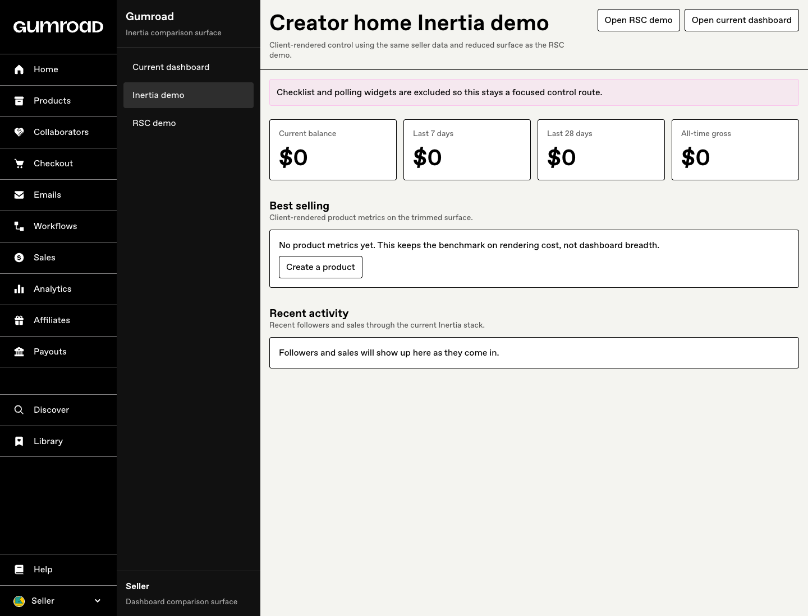
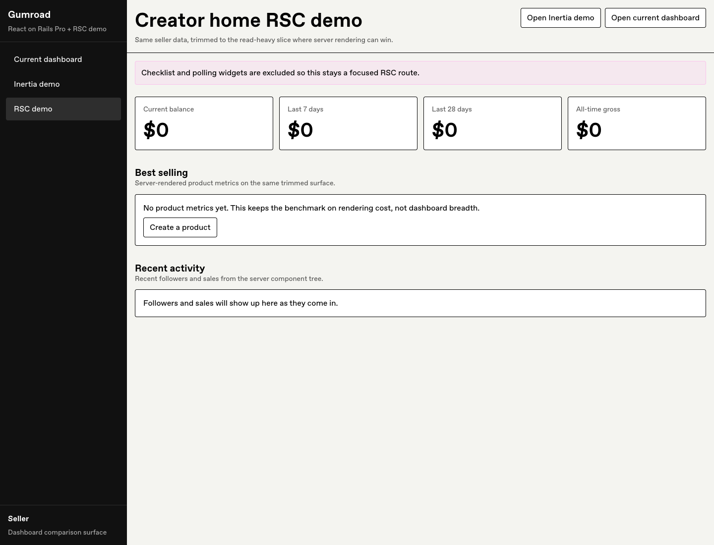

<p align="center">
  <picture>
    <source srcset="https://public-files.gumroad.com/logo/gumroad-dark.svg" media="(prefers-color-scheme: dark)">
    <source srcset="https://public-files.gumroad.com/logo/gumroad.svg" media="(prefers-color-scheme: light)">
    
  </picture>
</p>

<p align="center">
  <strong>Sell your stuff. See what sticks.</strong>
</p>

<p align="center">
  <a href="https://gumroad.com">Gumroad</a> is an e-commerce platform that enables creators to sell products directly to consumers. This repository contains the source code for the Gumroad web application.
</p>

> [!IMPORTANT]
> This is not Gumroad's canonical repository. It is a public ShakaCode demo derived from [`antiwork/gumroad`](https://github.com/antiwork/gumroad) to answer one practical performance question:
>
> Can React Server Components delivered through `react_on_rails` and React on Rails Pro make Gumroad's public, buyer-facing pages meaningfully faster than the current `Inertia` implementation, especially on mobile?

## React on Rails Pro Consumer-Page Performance Experiment

This repository tracks [antiwork/gumroad](https://github.com/antiwork/gumroad) and is being used by ShakaCode as a focused public demo comparing current Inertia-style public buyer pages against React Server Components candidates implemented with `react_on_rails`, React on Rails Pro, and React 19.

The priority is consumer-facing performance: public product pages, Discover marketplace pages, mobile buyers, SEO, first meaningful content, conversion, and route-level JavaScript cost. Dashboard pages are useful technical proof that the stack works, but they are not the value proof.

### Start here

- Hosted homepage with an explicit experiment callout: <https://gumroad.reactonrails.com>
- Planned Legacy Gumroad control (pre-RSC application): `legacy.gumroad.reactonrails.com`
- Planned Next Gumroad (same URLs/content, native RSC as routes reach parity): `next.gumroad.reactonrails.com`
- VP Engineering summary: <https://gumroad.reactonrails.com/rsc-demo>
- Live A/B performance lab: <https://gumroad.reactonrails.com/rsc-demo/evidence>
- Product before, matched Inertia route: <https://gumroad.reactonrails.com/public_product/inertia_demo>
- Product after, React Server Components via React on Rails Pro route: <https://gumroad.reactonrails.com/public_product/rsc_demo>
- Discover before, matched Inertia route: <https://gumroad.reactonrails.com/public_product/discover_inertia_demo>
- Discover after, React Server Components via React on Rails Pro route: <https://gumroad.reactonrails.com/public_product/discover_rsc_demo>
- React on Rails docs: <https://reactonrails.com/>
- React on Rails source: <https://github.com/shakacode/react_on_rails>
- ShakaCode: <https://www.shakacode.com/>
- Book a ShakaCode consultation: <https://meetings.hubspot.com/justingordon/30-minute-consultation>

- Performance evaluation notes: [docs/performance-evaluation.md](docs/performance-evaluation.md)
- Public product demo details: [docs/public-product-rsc-demo.md](docs/public-product-rsc-demo.md)
- Fixture sampling and sanitation notes: [docs/public-page-fixture-sampling.md](docs/public-page-fixture-sampling.md)
- Hosted public buyer-page performance results: [docs/public-buyer-page-performance-results.md](docs/public-buyer-page-performance-results.md)
- Historical dashboard/bundler findings: [docs/performance-findings.md](docs/performance-findings.md)
- Benchmark and positioning issue: [React on Rails issue #3144](https://github.com/shakacode/react_on_rails/issues/3144)

The source, renderer, and deployment invariants for these independent surfaces
are documented in [the three-surface topology](docs/three-surface-topology.md).

### Where TanStack Query fits

RSC removes client JavaScript from the static, server-rendered buyer pages. For the **interactive** islands — cart, checkout, anything that mutates or refetches — pair RSC with [TanStack Query](https://reactonrails.com/docs/building-features/tanstack-query): Rails stays the source of truth, the client gets caching, mutations, and cache invalidation. See the [TanStack starter](https://starter.reactonrails.com) for a full example.

### Who this demo is for

- Teams evaluating `react_on_rails`: inspect how React Server Components can run inside a real Rails app without turning the whole product page into a client-only island.
- Teams evaluating ShakaCode: use the demo, benchmark method, and tradeoff notes to judge how we approach Rails plus React performance work.
- Gumroad maintainers: focus on whether public product and Discover pages improve enough to justify trying these technologies in Gumroad itself.

### Public evaluation bar

The demo only matters if it proves a meaningful buyer-page advantage.

- Public product and Discover pages are the primary surfaces because they are logged out, SEO-sensitive, conversion-sensitive, and mobile-heavy.
- The committed fixtures are production-shaped and synthetic. A small public-page sampler confirmed the public Gumroad `Discover/Index` and `Products/Discover/Show` data shape, but this repo does not commit copied creator content, seller URLs, product URLs, or image URLs.
- The first supported implementation claim is architectural: the same fixture data can render as matched Inertia and React Server Components routes inside this Rails app.
- The current ShakaPerf CLI report shows much faster paint (`FCP -76%`; `LCP -74%/-49%`) and far fewer JavaScript requests (`41 -> 3`), but larger transfers, slower `TTFB`, and a Microsoft `TBT` regression. The suite exits `1` with `FAILED: 2 perf regressions`.
- This is a bounded mobile Lighthouse result for the native Microsoft 365 and Residential Design product pages. It supports a pilot, not an overall-superiority or production-adoption claim; field data and production parity remain required.

### July 2026 React on Rails Pro 17 / React 19.2 audit

The demo is on the React on Rails Pro 17 RC line with React 19.2.7, React on Rails Pro gem `17.0.0.rc.9`, React on Rails Pro npm `17.0.0-rc.9`, and `react-on-rails-rsc` `19.2.1-rc.1`. The public RSC routes now opt into Pro stream observability so `Server-Timing` can include streamed shell and Node renderer prepare attribution when the renderer returns it.

React on Rails Pro 17 also adds buffered/static RSC helpers and static RSC cache diagnostics that are attractive for public marketplace shells. This repo keeps the headline `/public_product/*_demo` route pairs matched and uncached so the A/B result remains an architecture comparison; a cached static RSC route should be measured and labeled as a separate variant.

The latest public Gumroad upstream contains buyer-local currency, richer public product/profile JSON endpoints, custom HTML product pages, and Discover category fixes. Those changes inform the fixture/adoption context, but a direct upstream merge is not part of this pass because upstream has also moved through a broad Vite migration and hundreds of unrelated changes.

### React Server Components via React on Rails, not Rspack, is the performance premise

Do not read this demo as "Rspack makes Gumroad pages faster."
That is not the claim.

- `Rspack` is supporting build infrastructure and a developer-experience improvement.
- `Shakapacker` is the Rails/Webpack-or-Rspack integration layer that lets the app move modern React assets through Rails cleanly.
- React Server Components delivered through `react_on_rails` and React on Rails Pro are the runtime architecture being tested for public buyer-page performance.

If the consumer-facing page wins, it should be because React Server Components through React on Rails reduce client JavaScript, serialized payload, hydration work, or mobile render cost enough to matter.
If the consumer-facing page does not win, faster bundling does not save the adoption case.

### Current public buyer-page implementation

The hosted lab now compares two production-shaped public surfaces:

| Surface              | Before: Inertia                         | After: React Server Components via React on Rails Pro | Why it matters                                                                                                                                   |
| -------------------- | --------------------------------------- | ----------------------------------------------------- | ------------------------------------------------------------------------------------------------------------------------------------------------ |
| Product detail       | `/public_product/inertia_demo`          | `/public_product/rsc_demo`                            | Product storytelling, pricing, reviews, seller context, CTA framing, FAQ, and recommendations are SEO- and conversion-sensitive.                 |
| Discover marketplace | `/public_product/discover_inertia_demo` | `/public_product/discover_rsc_demo`                   | Dense product grids, taxonomy navigation, filters, editorial context, prices, ratings, and seller cards are mobile-heavy public browse surfaces. |

The fixtures are synthetic but production-shaped. They were informed by the public Gumroad `Discover/Index` and `Products/Discover/Show` page shapes without committing creator copy, thumbnails, or seller URLs.
To re-sample Discover shape only, run `scripts/perf/sample_public_gumroad_shapes.mjs`. To re-sample product-page shape, pass an explicit public product URL locally and sanitize the output before sharing it. The sampler prints component names, prop keys, selected field shapes, and counts without writing scraped content into the repo. The current sanitized shape summary is in [docs/public-page-fixture-sampling.md](docs/public-page-fixture-sampling.md).

Important limitation: the current "before" route is a custom Inertia benchmark surface that uses the same synthetic fixture as the RSC route. That makes the framework/rendering comparison clean, but it is not yet a port of Gumroad's production `Discover/Index` or `Products/Discover/Show` components. The stronger follow-up is to wire sanitized production-shaped props into those real public components where feasible, then compare the RSC equivalent.

### Native product result from the actual ShakaPerf CLI

Captured August 12, 2026 with `shaka-perf v0.2.4`, Chrome
`151.0.7922.109`, and 10 simultaneous mobile Lighthouse measurements per side
and product. The control is pinned at `e720df1b4f13781af1b1b14efd10fe8a31e76641`
before the native RSC implementation; the experiment is
`0c16a6cd36a2e2c89a7090e21c838a013b4d2654`.

| Product            |                         FCP |                          LCP |     Lighthouse score |              TBT |                        TTFB |               JavaScript transfer |
| ------------------ | --------------------------: | ---------------------------: | -------------------: | ---------------: | --------------------------: | --------------------------------: |
| Microsoft 365      | `7.71s` -> `1.85s` (`-76%`) | `13.92s` -> `3.64s` (`-74%`) | `35` -> `77` (`+42`) | `0ms` -> `199ms` | `229ms` -> `315ms` (`+35%`) | `724.3KB` -> `2219.7KB` (`+206%`) |
| Residential Design | `7.81s` -> `1.85s` (`-76%`) | `16.88s` -> `8.63s` (`-49%`) | `43` -> `71` (`+28`) |   `0ms` -> `0ms` | `222ms` -> `341ms` (`+39%`) | `724.3KB` -> `2219.7KB` (`+206%`) |

The paint, LCP, and score changes are statistically significant (`p <= 0.0052`),
but this is not proof that RSC is better overall. TTFB and transferred bytes
regress on both products, Microsoft TBT regresses, and the command exits `1`
with `FAILED: 2 perf regressions`. See the exact pages, command, p-values,
visual/accessibility results, and raw JSON in the [August 12 native ShakaPerf
artifact](docs/performance-artifacts/native-product-rsc-shakaperf-2026-08-12/README.md).

### Historical stable Ruby/Selenium A/B result

Captured July 10, 2026 UTC against `https://gumroad.reactonrails.com` with headless Chrome `150.0.7871.49` / ChromeDriver `150.0.7871.115`, two independent batches of `8` alternating cycles per pair, and `2` server warmups per measured run.

This historical table was produced by the repository's Ruby/Selenium runner,
`scripts/perf/compare_dashboard_routes.rb`. It was previously labeled
"ShakaPerf," but it was not generated by the `shaka-perf` CLI. The real
ShakaPerf integration is documented separately below.

| Surface              |                 Median nav duration |                Median response end |                    Median LCP |                            JS transfer |    Inertia payload |
| -------------------- | ----------------------------------: | ---------------------------------: | ----------------------------: | -------------------------------------: | -----------------: |
| Product detail       |  `1123.5ms` -> `575.0ms` (`-48.8%`) | `504.85ms` -> `509.55ms` (`+0.9%`) |  `662ms` -> `602ms` (`-9.1%`) | `162,696 B` -> `82,228.5 B` (`-49.5%`) | `15,040 B` -> none |
| Discover marketplace | `1097.9ms` -> `630.45ms` (`-42.6%`) |   `473.9ms` -> `492.8ms` (`+4.0%`) | `768ms` -> `648ms` (`-15.6%`) |   `162,696 B` -> `82,223 B` (`-49.5%`) | `33,966 B` -> none |

Full navigation is clearly faster for the RSC candidate on both surfaces, JavaScript transfer is roughly halved, and the duplicated Inertia `data-page` payload is gone. Product LCP improves modestly; Discover LCP is directionally better but noisy across batches. Response end is not an RSC win, and RSC sends 80-100% more HTML because rendered content arrives in the document. This is an end-to-end route comparison, not RSC in isolation: the Inertia control also loads legacy application JavaScript and third-party analytics that the RSC route omits. See [docs/public-buyer-page-performance-results.md](docs/public-buyer-page-performance-results.md) and the immutable artifact in [docs/performance-artifacts/deployed-stable-media-public-buyer-pages-2026-07-10](docs/performance-artifacts/deployed-stable-media-public-buyer-pages-2026-07-10/README.md).

The June 24, 2026 hosted run (`-66.5%`/`-64.4%` median navigation on the pre-media fixture) predates the attributed product fixture and local synthetic media; it is retained as historical context in the results doc, not as the current headline.

### Live demo surface

Open the hosted public demo first:

- `https://gumroad.reactonrails.com`
- `https://gumroad.reactonrails.com/rsc-demo`
- `https://gumroad.reactonrails.com/rsc-demo/evidence`
- `https://gumroad.reactonrails.com/public_product/inertia_demo`
- `https://gumroad.reactonrails.com/public_product/rsc_demo`
- `https://gumroad.reactonrails.com/public_product/discover_inertia_demo`
- `https://gumroad.reactonrails.com/public_product/discover_rsc_demo`

The hosted homepage is intentionally modified so Rails teams, ShakaCode prospects, and Gumroad maintainers immediately see why public buyer pages matter. The short `/rsc-demo` decision brief summarizes measured benefits, costs, risks, and production gates without running a browser race. The detailed logged-out lab at `/rsc-demo/evidence` runs same-origin browser races against the matched product-detail and Discover routes, then links to each implementation route for manual inspection.

Local equivalents:

- `https://gumroad.dev/rsc-demo`
- `https://gumroad.dev/rsc-demo/evidence`
- `https://gumroad.dev/public_product/performance_demo`
- `https://gumroad.dev/public_product/inertia_demo`
- `https://gumroad.dev/public_product/rsc_demo`
- `https://gumroad.dev/public_product/discover_inertia_demo`
- `https://gumroad.dev/public_product/discover_rsc_demo`

All four public comparison routes render production-shaped synthetic fixtures and link back to the hosted homepage and lab. They intentionally do not link to `/l/demo` or seller subdomains on the hosted custom domain because `*.gumroad.reactonrails.com` is not configured for this demo and the benchmark should stay same-origin.

### What this repo currently proves

- The public product and Discover comparison route pairs are logged out and focused on buyer-facing page behavior, not seller admin UX.
- The live lab makes route script bytes and serialized payload differences visible immediately for both matched surfaces.
- The demo assets are route-scoped, so ordinary Inertia pages do not pay for the experiment's extra JS or CSS.
- GitHub-hosted demo validation includes browser smoke coverage for the public comparison routes.
- Route-scoped `Server-Timing` and an alternating comparison runner are available for disciplined A/B benchmarks.

### Still Needed Before A Gumroad Adoption Proposal

- Fix or explicitly accept the current ShakaPerf regressions: `TTFB +35%/+39%`, JavaScript transfer `+206%`, downloads `+56%/+36%`, and Microsoft `TBT 0 -> 199ms`.
- Re-run the native product pairs with production-equivalent analytics, caching, media, and bundle delivery, then corroborate with field data.
- Profile renderer, streaming, bundle, and hydration overhead before deciding whether the paint win justifies React Server Components via React on Rails Pro complexity.
- Keep dashboard routes out of the headline story except as technical integration evidence.

### Dashboard technical proof

The repo also exposes two dashboard comparison routes that use the same reduced seller-data surface. These are technical proofs for RSC integration and measurement, not the main SEO or conversion proof:

- `https://gumroad.dev/dashboard/inertia_demo`
- `https://gumroad.dev/dashboard/rsc_demo`

Latest production-like alternating local result on the reduced dashboard surface:

- Inertia median navigation duration: `775.40ms`
- RSC median navigation duration: `607.15ms`
- Inertia median `LCP`: `794.00ms`
- RSC median `LCP`: `634.00ms`
- Inertia median `responseEnd`: `644.80ms`
- RSC median `responseEnd`: `588.80ms`
- Inertia median `action_total`: `346.87ms`
- RSC median `action_total`: `339.20ms`

This pass built `RAILS_ENV=production NODE_ENV=production` Shakapacker/Rspack assets, built the standalone RSC demo bundles, ran Rails without the Shakapacker dev server, and used a dedicated React on Rails Pro Node renderer with matching `Chrome 147` and `ChromeDriver 147`.
It rotates route order by cycle instead of relying on separate batches.
The main caution is that `p95 responseEnd` still favored Inertia by `5.2%`, and the current RSC route does not expose a separate browser `/rsc_payload/` resource, so those payload resource fields are empty for this implementation.

Dashboard screenshots are kept as proof that the stack works against signed-in Gumroad data:

| Inertia dashboard technical proof             | React Server Components via React on Rails Pro dashboard proof |
| --------------------------------------------- | -------------------------------------------------------------- |
|  |                           |

### Optional signed-in technical proof routes

The headline public demo does not require a login. If you need to inspect older
signed-in dashboard proof routes during local development, use the credential
reference in [docs/users.md](docs/users.md) instead of treating those routes as
part of the public buyer-page value case.

### How to reproduce the comparison locally

1. Start local services: `LOCAL_DETACHED=true make local`
2. Prepare the database: `bin/rails db:prepare`
3. Start the app runtime in separate terminals:
   `bundle exec rails s -b 0.0.0.0 -p 3000`
   `npm run setup && ./bin/shakapacker-dev-server`
   `node client/node-renderer.cjs`
   The Node renderer uses the local `devPassword` fallback only in `development` and `test`; set `RENDERER_PASSWORD` for production-like or hosted runs.
   If port `3035` is already occupied by another local repo, start both Rails and the dev server with the same override, for example:
   `SHAKAPACKER_DEV_SERVER_PORT=3036 bundle exec rails s -b 0.0.0.0 -p 3000`
   `SHAKAPACKER_DEV_SERVER_PORT=3036 npm run setup && ./bin/shakapacker-dev-server`
4. Open the executive summary first:
   `/rsc-demo`
   Then open the detailed performance lab:
   `/rsc-demo/evidence`
   The lab auto-loads both matched public route pairs, shows first streamed bytes, complete response timing, HTML
   response size, route script bytes, and the serialized Inertia payload size.
5. Open the product-detail routes and compare:
   `/public_product/inertia_demo`
   `/public_product/rsc_demo`
6. Open the Discover routes and compare:
   `/public_product/discover_inertia_demo`
   `/public_product/discover_rsc_demo`
   The dashboard technical proof routes remain available, but they are not the SEO/conversion proof:
   `/dashboard/inertia_demo`
   `/dashboard/rsc_demo`
7. For the stricter product-detail benchmark method, run:
   `ruby scripts/perf/compare_dashboard_routes.rb --public --base-url https://gumroad.dev --measure-base-url https://gumroad.dev --path /public_product/inertia_demo --path /public_product/rsc_demo --label public-product-detail-alternating-8 --cycles 8 --server-warmup-requests 1 --require-driver-match`
8. For the stricter Discover benchmark method, run:
   `ruby scripts/perf/compare_dashboard_routes.rb --public --base-url https://gumroad.dev --measure-base-url https://gumroad.dev --path /public_product/discover_inertia_demo --path /public_product/discover_rsc_demo --label public-discover-alternating-8 --cycles 8 --server-warmup-requests 1 --require-driver-match`
   Use `/dashboard/inertia_demo` and `/dashboard/rsc_demo` with a dashboard-specific label only when benchmarking the technical proof.
   For a shorter smoke comparison, use the same commands with `--cycles 4`.

For the production-like local pass, first build compiled assets and initialize local Elasticsearch:
`RENDERER_PASSWORD=benchmarkRendererPassword RAILS_ENV=production NODE_ENV=production bin/shakapacker`
`RENDERER_PASSWORD=benchmarkRendererPassword RAILS_ENV=production NODE_ENV=production npm run build:rsc-demo`
`RENDERER_PASSWORD=benchmarkRendererPassword DISABLE_SPRING=1 OBJC_DISABLE_INITIALIZE_FORK_SAFETY=YES bin/rails runner 'DevTools.delete_all_indices_and_reindex_all'`
Then run Rails without `bin/shakapacker-dev-server`, start `RENDERER_PASSWORD=benchmarkRendererPassword RENDERER_PORT=3800 RENDERER_WORKERS_COUNT=2 RENDERER_LOG_LEVEL=warn node client/node-renderer.cjs`, and run the same comparison command with `--cycles 8`.

If a long comparison run is interrupted after it writes per-run JSON files, rerun the same command with `--reuse-existing` to emit the final comparison summary without discarding completed samples.

If you want the measured benchmark artifacts instead of a visual spot check, start with [docs/public-buyer-page-performance-results.md](docs/public-buyer-page-performance-results.md).

### Public evaluation docs

- [docs/public-product-rsc-demo.md](docs/public-product-rsc-demo.md)
- [docs/public-page-fixture-sampling.md](docs/public-page-fixture-sampling.md)
- [docs/public-buyer-page-performance-results.md](docs/public-buyer-page-performance-results.md)
- [docs/performance-findings.md](docs/performance-findings.md)
- [docs/performance-evaluation.md](docs/performance-evaluation.md)
- [docs/rsc-comparison-plan.md](docs/rsc-comparison-plan.md)
- [docs/control-plane-deployment.md](docs/control-plane-deployment.md)
- [docs/youtube-demo-script.md](docs/youtube-demo-script.md)

See [docs/rsc-comparison-plan.md](docs/rsc-comparison-plan.md) for the working plan, scope, and success criteria.
See [docs/current-status.md](docs/current-status.md) for engineering status details and remaining measurement work.

## See also

See also the [React on Rails Starter TanStack](https://github.com/shakacode/react-on-rails-starter-tanstack): the 2026 starter we ship, built on the same React on Rails Pro stack this demo benchmarks against Inertia.

## Table of Contents

- [Getting Started](#getting-started)
  - [Prerequisites](#prerequisites)
  - [Installation](#installation)
  - [Configuration](#configuration)
  - [Running Locally](#running-locally)
- [Development](#development)
  - [Logging in](#logging-in)
  - [Resetting Elasticsearch indices](#resetting-elasticsearch-indices)
  - [Push Notifications](#push-notifications)
  - [Common Development Tasks](#common-development-tasks)
  - [Linting](#linting)

## Getting Started

### Prerequisites

> 💡 If you're on Windows, follow our [Windows setup guide](docs/development/windows.md) instead.

Before you begin, ensure you have the following installed:

#### Ruby

- https://www.ruby-lang.org/en/documentation/installation/
- Install the version listed in [the .ruby-version file](./.ruby-version)

#### Node.js

- https://nodejs.org/en/download
- Install the version listed in [the .node-version file](./.node-version)

#### Docker

We use Docker to setup the services for development environment.

- For MacOS: Download the Docker app from the [Docker website](https://www.docker.com/products/docker-desktop)
- For Linux:

```bash
sudo wget -qO- https://get.docker.com/ | sh
sudo usermod -aG docker $(whoami)
```

#### MySQL & Percona Toolkit

Install a local version of MySQL 8.0.x to match the version running in production.

The local version of MySQL is a dependency of the Ruby `mysql2` gem. You do not need to start an instance of the MySQL service locally. The app will connect to a MySQL instance running in the Docker container.

- For MacOS:

```bash
brew install mysql@8.0 percona-toolkit
brew link --force mysql@8.0

# to use Homebrew's `openssl`:
brew install openssl
bundle config --global build.mysql2 --with-opt-dir="$(brew --prefix openssl)"

# ensure MySQL is not running as a service
brew services stop mysql@8.0
```

- For Linux:
  - MySQL:
    - https://dev.mysql.com/doc/refman/8.0/en/linux-installation.html
    - `apt install libmysqlclient-dev`
  - Percona Toolkit: https://www.percona.com/doc/percona-toolkit/LATEST/installation.html

#### Image Processing Libraries

##### ImageMagick

We use `imagemagick` for preview editing.

- For MacOS: `brew install imagemagick`
- For Linux: `sudo apt-get install imagemagick`

##### libvips

For newer image formats we use `libvips` for image processing with ActiveStorage.

- For MacOS: `brew install libvips`
- For Linux: `sudo apt-get install libvips-dev`

#### FFmpeg

We use `ffprobe` that comes with `FFmpeg` package to fetch metadata from video files.

- For MacOS: `brew install ffmpeg`
- For Linux: `sudo apt-get install ffmpeg`

#### PDFtk

We use [pdftk](https://www.pdflabs.com/tools/pdftk-server/) to stamp PDF files with the Gumroad logo and the buyers' emails.

- For MacOS: Download from [here](https://www.pdflabs.com/tools/pdftk-the-pdf-toolkit/pdftk_server-2.02-mac_osx-10.11-setup.pkg)
  - **Note:** pdftk may be blocked by Apple's firewall. If this happens, go to Settings > Privacy & Security and click "Open Anyways" to allow the installation.
- For Linux: `sudo apt-get install pdftk`

#### wkhtmltopdf

While generating invoices, to convert HTML to PDF, PDFKit expects [wkhtmltopdf](https://wkhtmltopdf.org/) to be installed on your system. [Download](https://wkhtmltopdf.org/downloads.html) and install the version 0.12.6 for your platform.

- **Note** similar to pdftk, this may also be blocked by Apple's firewall on MacOS. Follow a similar process as above.

### Installation

#### Bundler and gems

We use Bundler to install Ruby gems.

```shell
gem install bundler
```

Install gems:

```shell
bundle install
```

Also make sure to install `dotenv` as it is required for some console commands:

```shell
gem install dotenv
```

#### npm and Node.js dependencies

Make sure the correct version of `npm` is enabled:

```shell
corepack enable
```

Install dependencies:

```shell
npm install
```

### Configuration

#### Set up Custom credentials

App can be booted without any custom credentials. But if you would like to use services that require custom credentials (e.g. S3, Stripe, Resend, etc.), you can copy the `.env.example` file to `.env` and fill in the values.

### Running Locally

#### Start Docker services

If you installed Docker Desktop (on a Mac or Windows machine), you can run the following command to start the Docker services:

```shell
make local
```

If you are on Linux, or installed Docker via a package manager on a mac, you may have to manually give docker superuser access to open ports 80 and 443. To do that, use `sudo make local` instead.

This command will not terminate. You run this in one tab and start the application in another tab.
If you want to run Docker services in the background, use `LOCAL_DETACHED=true make local` instead.

#### Set up the database

```shell
bin/rails db:prepare
```

For Linux (Debian / Ubuntu) you might need the following:

- `apt install libxslt-dev libxml2-dev`

#### Start the application

```shell
bin/dev
```

This starts the Rails server, the JavaScript build system, and a Sidekiq worker. It also builds and watches the React Server Components demo bundles, so the RSC demo routes (`/public_product/rsc_demo`, `/public_product/discover_rsc_demo`, and the dashboard RSC demo) render without a separate build step.

You can now access the application at `https://gumroad.dev`.

#### Run the RSC request smoke hard gate

The request smoke specs load the test Shakapacker output from `public/packs-test`, so build both the standard test packs and the standalone RSC demo bundles in the test environment before starting the renderer:

```shell
(
  set -e

  renderer_host=127.0.0.1
  renderer_port=3800
  renderer_url="http://$renderer_host:$renderer_port"

  RAILS_ENV=test NODE_ENV=test bin/shakapacker
  npm run build:rsc-demo:test
  if nc -z "$renderer_host" "$renderer_port"; then
    echo "Port $renderer_port is already in use; stop the existing renderer before running this smoke gate."
    exit 1
  fi
  RENDERER_PASSWORD=devPassword RENDERER_HOST="$renderer_host" RENDERER_PORT="$renderer_port" RENDERER_LOG_LEVEL=warn node client/node-renderer.cjs &
  renderer_pid=$!
  trap 'kill "$renderer_pid" 2>/dev/null || true' EXIT
  until nc -z "$renderer_host" "$renderer_port"; do
    if ! kill -0 "$renderer_pid" 2>/dev/null; then
      wait "$renderer_pid"
      exit 1
    fi
    sleep 1
  done
  REACT_RENDERER_URL="$renderer_url" DISABLE_SPRING=1 RAILS_ENV=test bundle exec rspec spec/requests/dashboard_demo_smoke_spec.rb spec/requests/public_product_demo_smoke_spec.rb
)
```

If a previous run started the renderer before `public/packs-test/react-client-manifest.json` existed, stop the renderer and remove `.node-renderer-bundles` before rerunning the hard gate so the renderer cache is rebuilt with the test client manifest.

#### Run the ShakaPerf A/B tests

The default suite compares five representative products from the canonical
development/staging catalog. Both isolated twins build the same current
checkout and seed the same 16 products. Absolute seller-host URLs select Legacy
Inertia on port `3100` and Next RSC on port `3200`; renderer selection is the
only experimental difference.

Run `npm run test:shakaperf` for the URL/config/discovery contract, or see
[ShakaPerf A/B testing](docs/shakaperf-ab-testing.md) for the exact URLs, twin
commands, runtime environment, and separately archived August 2026 benchmark
definitions.

## Development

### Logging in

For local development credentials and team-role examples, see [Users & authentication](docs/users.md).

### Resetting Elasticsearch indices

You will need to explicitly reindex Elasticsearch to populate the indices after setup, otherwise you will see `index_not_found_exception` errors when you visit the dev application. You can reset them using:

```ruby
# Run this in a rails console:
DevTools.delete_all_indices_and_reindex_all
```

### Push Notifications

To send push notifications:

```shell
INITIALIZE_RPUSH_APPS=true bundle exec rpush start -e development -f
```

### Common Development Tasks

#### Rails console:

```shell
bin/rails c
```

#### Rake tasks:

```shell
bin/rake task_name
```

### Linting

We use ESLint for JS, and Rubocop for Ruby. Your editor should support displaying and fixing issues reported by these inline, and CI will automatically check and fix (if possible) these.

If you'd like, you can run `git config --local core.hooksPath .githooks` to check for these locally when committing.

## Common Issues

### macOS Error When Running Tests (Related to `fork()`)

```
objc[11912]: +[__NSCFConstantString initialize] may have been in progress in another thread when fork() was called.
objc[11912]: +[__NSCFConstantString initialize] may have been in progress in another thread when fork() was called. We cannot safely call it or ignore it in the fork() child process. Crashing instead. Set a breakpoint on objc_initializeAfterForkError to debug.
```

This issue occurs on macOS due to how the `fork()` system call interacts with multithreaded Objective-C applications—commonly triggered when Spring is enabled during testing.

#### How to Fix:

Temporarily disable Spring before running your tests to avoid this error.

```bash
export DISABLE_SPRING=1
bin/rspec spec/requests/balance_pages_spec.rb
```

This will disable Spring for the current session, allowing the tests to run without triggering the `fork()`-related crash.
